:::::::::::::::::::::::::::::::::::::: questions

- How to aggregate and summarize case data?
- How to visualize aggregated data?
- What is the distribution of cases across time, space, gender, and age?

::::::::::::::::::::::::::::::::::::::::::::::::

::::::::::::::::::::::::::::::::::::: objectives

- Simulate synthetic outbreak data
- Convert linelist data into incidence over time
- Create epidemic curves from incidence data

::::::::::::::::::::::::::::::::::::::::::::::::

::::::::::::::::::::: prereq

**R packages installed:** `{incidence2}`, `{simulist}`, `{tidyverse}`.

:::::::::::::::::::::

:::::::::: spoiler

Install these packages if they are not already installed

```r
if (!base::require("pak")) install.packages("pak")
pak::pak(c("incidence2", "simulist", "tidyverse"))
```

If you have any error message,
go to the [main setup page](../learners/setup.md#software-setup).

::::::::::

## Introduction

In an analytic pipeline, exploratory data analysis (EDA) is an important step before formal modeling.
EDA helps determine relationships between variables and summarize their main characteristics, often by means of data visualization.

This episode focuses on EDA of outbreak data using R packages. 
A key aspects of EDA in epidemic analysis are **person, place, and time**. It is useful to identify how observed events--such as confirmed cases, hospitalizations, deaths, and recoveries--change over time, and how these vary across different locations and demographic factors, including gender, age, and more.

Let's start by loading the `{incidence2}` package to aggregate the linelist data according to specific characteristics, and visualize the resulting epidemic curves (epicurves) that plot the number of new events (i.e. case incidence over time).
We'll use the `{simulist}` package to simulate the outbreak data to analyze.
We'll use the pipe operator (`%>%`) to connect some of their functions, including others from the `{dplyr}` and `{ggplot2}` packages, so let's also load the {tidyverse} package.


``` r
# Load packages
library(incidence2) # For aggregating and visualizing
library(simulist) # For simulating linelist data
library(tidyverse) # For {dplyr} and {ggplot2} functions and the pipe %>%
```

## Synthetic outbreak data

To illustrate the process of conducting EDA on outbreak data, we will generate a line list for a hypothetical disease outbreak utilizing the `{simulist}` package.
`{simulist}` generates simulated data for an outbreak according to a given configuration.
Its minimal configuration can generate a linelist, as shown in the code chunk below:


``` r
# Set seed for reproducibility
set.seed(1)

# Simulate linelist data for an outbreak with size between 1000 and 1500
sim_data <- simulist::sim_linelist(outbreak_size = c(1000, 1500)) %>%
  dplyr::as_tibble() # for a simple data frame output

# Display the simulated dataset
sim_data
```

``` output
# A tibble: 1,546 × 13
      id case_name         case_type sex     age date_onset date_reporting
   <int> <chr>             <chr>     <chr> <int> <date>     <date>        
 1     1 Travis Kurek      confirmed m        37 2023-01-01 2023-01-01    
 2     3 Courtney Mccoy    probable  f        12 2023-01-11 2023-01-11    
 3     6 Andrea Alarid     confirmed f        53 2023-01-18 2023-01-18    
 4     8 Salwa el-Sharifi  suspected f        36 2023-01-23 2023-01-23    
 5    11 Azza al-Noorani   suspected f        77 2023-01-30 2023-01-30    
 6    14 Olivya Pinto      probable  f        37 2023-01-24 2023-01-24    
 7    15 Acineth Briones   suspected f        67 2023-01-31 2023-01-31    
 8    16 Mahuroos el-Javed confirmed m        80 2023-01-30 2023-01-30    
 9    20 Awad el-Idris     probable  m        70 2023-01-27 2023-01-27    
10    21 Matthew Friend    confirmed m        87 2023-02-09 2023-02-09    
# ℹ 1,536 more rows
# ℹ 6 more variables: date_admission <date>, outcome <chr>,
#   date_outcome <date>, date_first_contact <date>, date_last_contact <date>,
#   ct_value <dbl>
```

This linelist dataset contains simulated individual-level records of events during an outbreak.

::::::::::::::::::: spoiler

### Additional resources on outbreak data

The above is the default configuration of `{simulist}`.
It includes a number of assumptions about the transmissibility and severity of the pathogen.
If you want to know more about the `simulist::sim_linelist()` function and other functionalities, check the [documentation website](https://epiverse-trace.github.io/simulist/).

You can also find datasets from past real outbreaks within the [outbreaks](https://www.reconverse.org/outbreaks/) R package.

:::::::::::::::::::


## Aggregating  linelist 

Often we want to analyze and visualize the number of events that occur on a particular day or week, rather than focusing on individual cases. This requires converting the linelist data into incidence data. The [{incidence2}](https://www.reconverse.org/incidence2/articles/incidence2.html) package offers a useful function called `incidence2::incidence()` for aggregating case data around dated events. It can also aggregate data on other characteristics (e.g., sex). The code chunk provided below demonstrates the creation of an `<incidence2>` class object from the simulated  Ebola `linelist` data based on the date of onset.


``` r
# Create an incidence object by aggregating case data based on the date of onset
daily_incidence <- incidence2::incidence(
  sim_data,
  date_index = "date_onset",
  interval = "day" # Aggregate by daily intervals
)

# View the incidence data
daily_incidence
```

``` output
# incidence:  232 x 3
# count vars: date_onset
   date_index count_variable count
   <date>     <chr>          <int>
 1 2023-01-01 date_onset         1
 2 2023-01-11 date_onset         1
 3 2023-01-18 date_onset         1
 4 2023-01-23 date_onset         1
 5 2023-01-24 date_onset         1
 6 2023-01-27 date_onset         2
 7 2023-01-29 date_onset         1
 8 2023-01-30 date_onset         2
 9 2023-01-31 date_onset         2
10 2023-02-01 date_onset         1
# ℹ 222 more rows
```

You can use numeric values, as number of days to group, or text string such `day`, `week`, `epiweek`, `months`, and more to setup the aggregating interval:


``` r
# Create an incidence object by aggregating case data based on the date of onset
weekly_incidence <- incidence2::incidence(
  sim_data,
  date_index = "date_onset",
  interval = "week" # Aggregate by weekly intervals
)

# View the incidence data
weekly_incidence
```

``` output
# incidence:  38 x 3
# count vars: date_onset
   date_index count_variable count
   <isowk>    <chr>          <int>
 1 2022-W52   date_onset         1
 2 2023-W02   date_onset         1
 3 2023-W03   date_onset         1
 4 2023-W04   date_onset         5
 5 2023-W05   date_onset        16
 6 2023-W06   date_onset        10
 7 2023-W07   date_onset        22
 8 2023-W08   date_onset        16
 9 2023-W09   date_onset        19
10 2023-W10   date_onset        44
# ℹ 28 more rows
```

With the `{incidence2}` package, you can specify the desired time interval (e.g., day, week, etc.) and categorize cases by one or more factors. Below is a code snippet demonstrating weekly cases grouped by the date of onset, sex, and type of case.


``` r
# Group incidence data by week, accounting for sex and case type
weekly_group_incidence <- incidence2::incidence(
  sim_data,
  date_index = "date_onset",
  interval = "week", # Aggregate by weekly intervals
  groups = c("sex", "case_type") # Group by sex and case type
)

# View the incidence data
weekly_group_incidence
```

``` output
# incidence:  199 x 5
# count vars: date_onset
# groups:     sex, case_type
   date_index sex   case_type count_variable count
   <isowk>    <chr> <chr>     <chr>          <int>
 1 2022-W52   m     confirmed date_onset         1
 2 2023-W02   f     probable  date_onset         1
 3 2023-W03   f     confirmed date_onset         1
 4 2023-W04   f     probable  date_onset         1
 5 2023-W04   f     suspected date_onset         1
 6 2023-W04   m     confirmed date_onset         1
 7 2023-W04   m     probable  date_onset         2
 8 2023-W05   f     confirmed date_onset         5
 9 2023-W05   f     probable  date_onset         2
10 2023-W05   f     suspected date_onset         2
# ℹ 189 more rows
```

::::::::::::::::::::::::::::::::::::: callout

### Dates completion

When cases are grouped by different factors, it's possible that the events involving these groups may have different date ranges in the resulting `incidence2` object. For example:


``` r
# Create a daily incidence object grouped by sex
incidence2::incidence(
  sim_data,
  date_index = "date_onset",
  groups = "sex",
  interval = "week",
  complete_dates = FALSE # Default
)
```

``` output
# incidence:  73 x 4
# count vars: date_onset
# groups:     sex
   date_index sex   count_variable count
   <isowk>    <chr> <chr>          <int>
 1 2022-W52   m     date_onset         1
 2 2023-W02   f     date_onset         1
 3 2023-W03   f     date_onset         1
 4 2023-W04   f     date_onset         2
 5 2023-W04   m     date_onset         3
 6 2023-W05   f     date_onset         9
 7 2023-W05   m     date_onset         7
 8 2023-W06   f     date_onset         3
 9 2023-W06   m     date_onset         7
10 2023-W07   f     date_onset        10
# ℹ 63 more rows
```

The `{incidence2}` package provides a function called `incidence2::complete_dates()` to ensure that an incidence object has the same range of dates for each group.
By default, missing counts for a particular group will be filled with `0` for that date.

This functionality is also available within the `incidence2::incidence()` function by setting the value of the `complete_dates` to `TRUE`.


``` r
# Create a daily incidence object grouped by sex
incidence2::incidence(
  sim_data,
  date_index = "date_onset",
  groups = "sex",
  interval = "week",
  complete_dates = TRUE # Complete dates and missing counts
)
```

``` output
# incidence:  78 x 4
# count vars: date_onset
# groups:     sex
   date_index sex   count_variable count
   <isowk>    <chr> <chr>          <int>
 1 2022-W52   f     date_onset         0
 2 2022-W52   m     date_onset         1
 3 2023-W01   f     date_onset         0
 4 2023-W01   m     date_onset         0
 5 2023-W02   f     date_onset         1
 6 2023-W02   m     date_onset         0
 7 2023-W03   f     date_onset         1
 8 2023-W03   m     date_onset         0
 9 2023-W04   f     date_onset         2
10 2023-W04   m     date_onset         3
# ℹ 68 more rows
```

::::::::::::::::::::::::::::::::::::::::::::::::

::::::::::::::::::::::::::::::::::::: challenge

Use the `sim_data` linelist to:

- Calculate the incidence of cases **every 2 weeks** for **two different dates**, the date of symptom onset and the date of outcome, and **two different categories**, sex and case type.
- Save the result in one `<incidence2>` object called `biweekly_incidence`.

::::::::::::::::::: hint

As mentioned above, to setup the aggregrating interval we can use numeric values or text strings. Or review the reference manual of the function `incidence2::incidence()` either offline using `?incidence2::incidence()` or [online](https://www.reconverse.org/incidence2/manual.html#sec:man-incidence).

To aggregate by two or more date index, find one example in this how-to guide entry on [Simulate, Clean, Validate linelist, and plot Epidemic curves](https://epiverse-trace.github.io/howto/analyses/describe_cases/simulist-cleanepi-messy-data.html). There we count the incidence for three different dates in the same object.

:::::::::::::::::::

::::::::::::::::::::::::::::::::::::::::::::::::

::::::::::::::::::::::::::::::: checklist

**Why to convert linelist to incidence?**

- To analyze data by person, place, and time:

    - Track how events (cases, hospitalizations, deaths, recoveries) change over time (by day or week).
    - Compare patterns across locations and demographic groups (e.g., age, sex, location).

- Also describe and prepare data before modelling. (More on this in the next set of tutorials!)

:::::::::::::::::::::::::::::::

## Visualization

The `incidence2` objects can be visualized using the `plot()` function from the base R package.
The resulting graph is referred to as an epidemic curve, or epicurve for short.
The following code snippets generate epicurves for the `daily_incidence` and `weekly_group_incidence` incidence objects mentioned above.


``` r
# Plot daily incidence data
plot(daily_incidence)
```

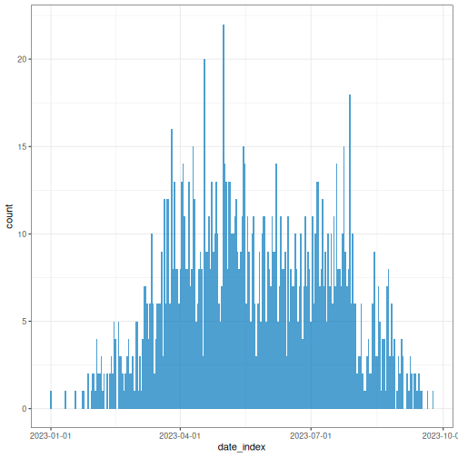

You can opt for the most appropriate aggregation time unit that describe the spread or transmission pattern.


``` r
# Plot weekly incidence data
plot(weekly_incidence)
```

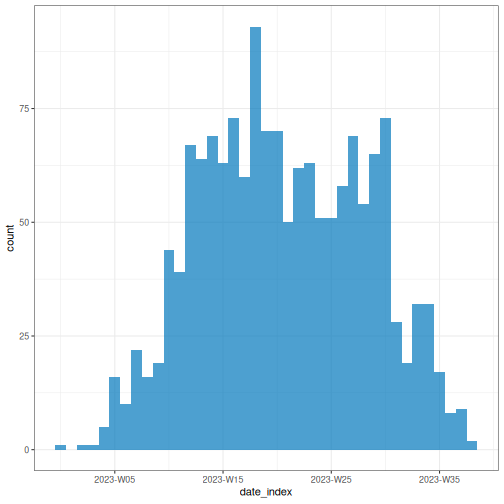

Plotting an `<incidence2>` object relies on the `{ggplot2}` package, so [`ggplot` layers](https://ggplot2-book.org/layers.html) can be added to the plot as shown below.


``` r
# Plot weekly incidence data
plot(weekly_incidence) +
  ggplot2::labs(
    x = "Time (in weeks)", # x-axis label
    y = "Number of cases", # y-axis label
    title = "Epidemic curve, simulated outbreak",
    subtitle = "Weekly case incidence by date of onset"
  )
```

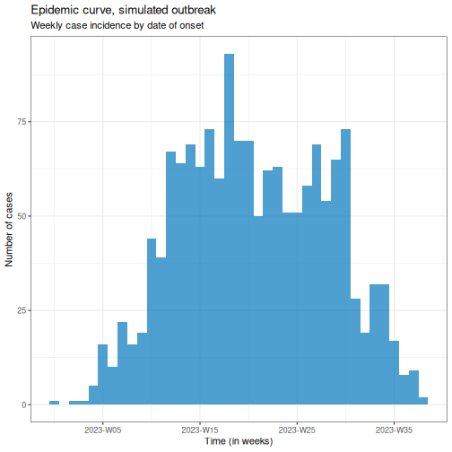

Also, provide an stratified plot by categories to compare transmission patterns across different demographic groups.


``` r
# Plot weekly incidence data
plot(weekly_group_incidence) +
  ggplot2::labs(
    x = "Time (in weeks)", # x-axis label
    y = "weekly cases" # y-axis label
  )
```

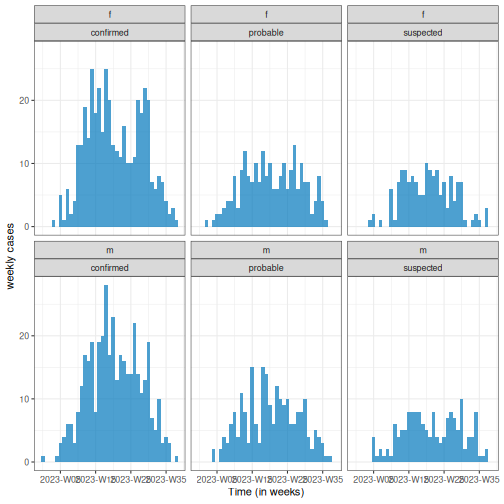

:::::::::::::::::::::::: callout

#### Easy aesthetics

Find out how you can use the arguments within the `plot()` function to provide aesthetics to your `<incidence2>` objects.


``` r
weekly_group_incidence %>%
  plot(fill = "case_type")
```

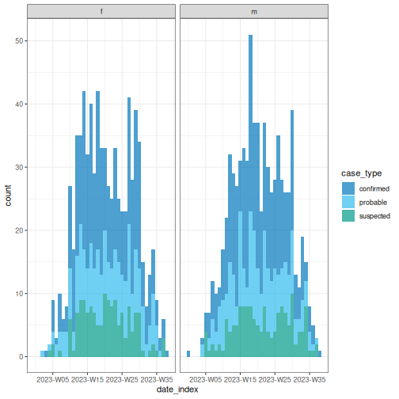

Some of them include `show_cases = TRUE`, `angle = 45`, and `n_breaks = 5`.
Try them and see how they impact on the resulting plot.


``` r
weekly_group_incidence %>%
  plot(fill = "sex", angle = 45)
```

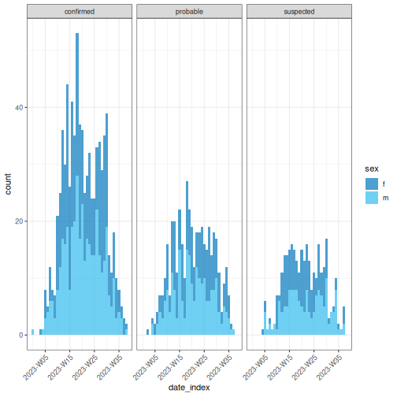

We invite you to take a look at the [reference manual of the funcion `plot()`](https://www.reconverse.org/incidence2/manual.html#sec:man-plot.incidence2).

::::::::::::::::::::::::

::::::::::::::::::::::::::::::::::::: challenge

Use the `biweekly_incidence` created in the previous challenge to:

- Visualize the incidence curve.
- Identify what combination of arguments in `plot()` work best.

::::::::::::::: hint

Test if arguments like `fill`, `nrow`, `show_cases`, `angle`, or `n_breaks` improve the plot.

Find one more example in this how-to guide entry on [Plot age-stratified incidence data by month from date of birth](https://epiverse-trace.github.io/howto/analyses/describe_cases/cleanepi-linelist-incidence2-stratified.html)

:::::::::::::::

::::::::::::::::::::::::::::::::::::::::::::::::

::::::::::::::::::::::::::::: checklist

**What are common challenges when aggregating linelist to incidence?**

- Aggregate by *one or more variables* jointly:

    - By date (e.g., date of report and date of death) for outbreak severity analysis.
    - By groups (e.g., age, sex, or location) for stratified analyses of transmission or severity.

- Get a *complete time series* to have the same range of dates for each grouping.

:::::::::::::::::::::::::::::

## How to describe an epidemic curve?

We can describe epicurves by comparing the trend of new cases over time between demographic groups. Some features we can compare are:

- Size of peak or plateau,
- Time to peak (if any),
- Growth rate.

For example, in the figure below, we have two epidemic curves for the same outbreak stratified by sex. In the population, most cases were observed in females.

- The size of the peak in females was ~70 incident cases; in males this was ~22 incident cases.
- The peak in females occurred around epiweek 15; in males this was around epiweek 20.
- The growth rate in females may be higher than in males. In a same period of time (about 15 weeks), cases in females were more than 3 times the cases in males.

<div class="figure" style="text-align: center">
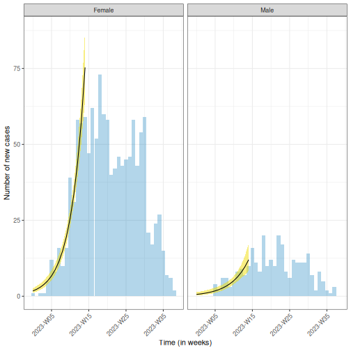
<p class="caption">Weekly incidence of simulated cases by sex, with fitted growth trajectories (Poisson regression, shaded ribbon = 95% CI) during the first 15 weeks of the outbreak (exponential growth phase).</p>
</div>

You can estimate the peak -- the time with the highest number of recorded cases -- using `incidence2::estimate_peak()`. Also you can convert the count of new or incident cases to cumulative using `incidence2::cumulate()` if needed for your downstream analysis. Find examples about them on the [incidence2 vignette section about "Bootstrapping and estimating peaks"](https://www.reconverse.org/incidence2/vignette.html#sec:bootstrapping-and-estimating-peaks)


::::::: caution

#### Reporting delay

Recent cases are likely undercounted. If there is a lag between an event occurring and it being recorded, the most recent time periods will appear artificially low simply because many cases have not been logged yet. This can make it look like there is a recent decline when it is really just a reporting delay (also known as a [right-censoring](../learners/reference.md#rightcensoring) effect).

While not an issue for the resolved outbreak above, this is a key consideration for **ongoing or growing outbreaks**, where an apparent recent decline may simply reflect delayed reporting rather than a true slowdown.

:::::::

<!--

Possible challenge

Using the simulated linelist stored in `sim_data`, complement the description of the outbreak:

- Calculate the reporting delay using `{cleanepi}`.
- Plot a histogram of the reporting delay using `{ggplot2}`.
- Describe the reporting delay distribution using tradicional summary statistics.

hint

- The reporting delay is the time span from the `date_onset` to the `date_reporting`.
- Use `cleanepi::timespan()` as introduced in the episode on **Clean case data**

-->

::::::::::::: discussion

**Why we use epidemic curves?**

Generally, to describe the *size* and *time trend* of outbreak, and differences between *groups* (e.g., demographics).
It could provide evidence to give an answer to a question like:
Should we consider targeted over mass interventions?

It also can help us to determine the pattern of spread (like point source, propagated source, or others), and investigate an outbreak based on disease parameters (like determine the exposure time based on the incubation period).

:::::::::::::

:::::: solution

### Identify type of epidemic or mode of transmission

We recommend you read the section on ["Analysing and epi curve"](https://outbreaktools.ca/background/epidemic-curves/). It describes some patterns of spread we summarize here:

| Type | Description | Shape of Epidemic Curve | Example |
|------|-------------|------------------------|---------|
| Point Source | Single shared exposure over a brief period | Sharp rise → peak → sharp fall (reflects incubation period) | Food poisoning from a single meal |
| Continuous Source | Prolonged exposure to the same source | Gradual rise, no clear peak, extended duration | Contaminated water supply over several days |
| Propagated Source | Person-to-person transmission | Successive waves or multiple peaks | Measles, COVID-19 |
| Intermittent Source | Repeated but irregular exposure to the same source | Multiple peaks at irregular intervals and varying sizes | A restaurant periodically serving contaminated food |

You can also complete this [Quick-Learn Lesson on "Using an Epi Curve to Determine Mode of Spread"](https://www.cdc.gov/training/quicklearns/epimode/) to train on how to determine the outbreak's likely mode of spread by analyzing an epidemic curve.

::::::

:::::: solution

### Investigate outbreaks

From an epicurve of incident cases by date on symptom onset, we can determine:

- The incubation period, if the exposure time is known; or
- The exposure time, if the incubation period is known.

The *incubation period* is defined as the average time from infection to first clinical symptoms ([Figure 2 at On Kwok, et al.](https://www.sciencedirect.com/science/article/pii/S2001037018301703#f0010)). This varies from individual to individual for the same disease. 

For example, measles has an incubation period with a range of 7-20 days (minimum/maximum), and a median of 12.5 days.


``` output
Using Lessler J, Reich N, Brookmeyer R, Perl T, Nelson K, Cummings D (2009).
"Incubation periods of acute respiratory viral infections: a systematic
review." _The Lancet Infectious Diseases_.
doi:10.1016/S1473-3099(09)70069-12
<https://doi.org/10.1016/S1473-3099%2809%2970069-12>.. 
To retrieve the citation use the 'get_citation' function
```

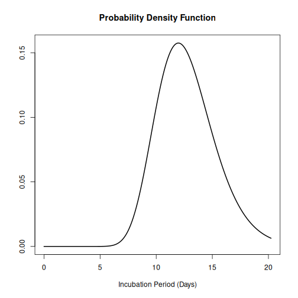

Knowing the incubation period of the pathogen allows us to estimate when exposure occurred by working backwards from symptom onset on the epidemic curve:

- The start of exposure can be estimated by subtracting the *minimum* incubation period from the date of the first case.
- The end of exposure can be estimated by subtracting the *maximum* incubation period from the date of the last case.

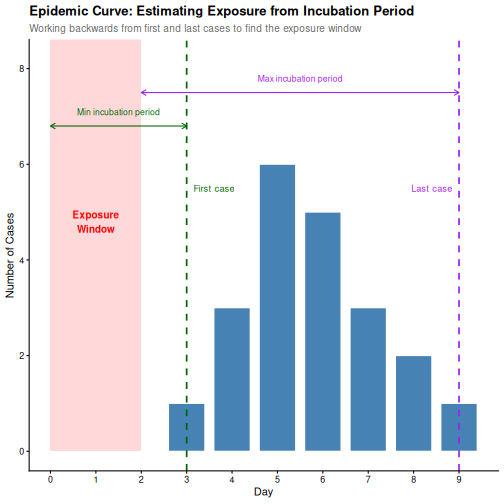

::::::

:::::::::::::::::::::::: checklist

An outbreak can be described using:

- Incidence plots or epidemic curves from linelist (using `{incidence2}`)
- Contact networks from contact data (using `{epicontacts}`).
- Delays between dated events from linelist (using `{cleanepi}` or `{tidyverse}`)

In the next set of tutorials we will learn how to inform an outbreak assessment based on estimated parameters of transmission (growth rate and reproduction number), severity (case fatality risk) using more comprenhensive models and statistical distributions.

For a refresher on delays and probability distributions, you can review introductory concepts with [some episodes introducing delays for outbreak data](https://epiverse-trace.github.io/tutorials/).

::::::::::::::::::::::::

::::::::::::::::::::::::::::::::::::: challenge

Which combination of time unit, case categories, and arguments in `plot()` best captures the outbreak pattern of `sim_data` and why?

Write some sentences describing your learnings.

::::::::::::::::::::::::::::::::::::::::::::::::

Lastly, `{incidence2}` produces basic plots for epicurves, but additional work is required to create well-annotated graphs.
However, using the `{ggplot2}` package, you can generate more sophisticated epicurves, with more flexibility in annotation.
Find alternatives about how to improve your epicurves in the spoiler below:

:::::::::::::::::::::: spoiler

#### Visualization with ggplot2

We will focus on three key elements for producing epicurves: histogram plots, scaling date axes and their labels, and general plot theme annotation.
The example below demonstrates how to configure these three elements for a simple `{incidence2}` object.


``` r
# Define date breaks for the x-axis
breaks <- seq.Date(
  from = min(as.Date(daily_incidence$date_index, na.rm = TRUE)),
  to = max(as.Date(daily_incidence$date_index, na.rm = TRUE)),
  by = 20 # every 20 days
)

# Create the plot
ggplot2::ggplot(data = daily_incidence) +
  geom_histogram(
    mapping = aes(
      x = as.Date(date_index),
      y = count
    ),
    stat = "identity",
    color = "blue", # bar border color
    fill = "lightblue", # bar fill color
    width = 1 # bar width
  ) +
  theme_minimal() + # apply a minimal theme for clean visuals
  theme(
    plot.title = element_text(face = "bold", hjust = 0.5), # title center + bold
    plot.subtitle = element_text(hjust = 0.5), # center subtitle
    plot.caption = element_text(face = "italic", hjust = 0), # italic caption
    axis.title = element_text(face = "bold"), # bold axis titles
    axis.text.x = element_text(angle = 45, vjust = 0.5) # rotated x-axis text
  ) +
  labs(
    x = "Date", # x-axis label
    y = "Number of new cases", # y-axis label
    title = "Daily Outbreak Cases", # plot title
    subtitle = "Epidemiological Data for the Outbreak", # plot subtitle
    caption = "Data Source: Simulated Data" # plot caption
  ) +
  scale_x_date(
    breaks = breaks, # set custom breaks on the x-axis
    labels = scales::label_date_short() # shortened date labels
  )
```

``` warning
Warning in geom_histogram(mapping = aes(x = as.Date(date_index), y = count), :
Ignoring unknown parameters: `binwidth` and `bins`
```

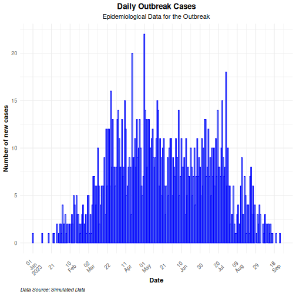

Use the `group` option in the mapping function to visualize an epicurve with different groups.
If there is more than one grouping factor, use the `facet_wrap()` option, as demonstrated in the example below:


``` r
# Create a daily incidence object grouped by sex
daily_incidence_2 <- incidence2::incidence(
  sim_data,
  date_index = "date_onset",
  groups = "sex",
  interval = "day", # Aggregate by daily intervals
  complete_dates = TRUE # Complete missing dates
)
```


``` r
# Plot daily incidence faceted by sex
ggplot2::ggplot(data = daily_incidence_2) +
  geom_histogram(
    mapping = aes(
      x = as.Date(date_index),
      y = count,
      group = sex,
      fill = sex
    ),
    stat = "identity"
  ) +
  theme_minimal() + # apply minimal theme
  theme(
    plot.title = element_text(face = "bold", hjust = 0.5), # title bold + center
    plot.subtitle = element_text(hjust = 0.5), # center the subtitle
    plot.caption = element_text(face = "italic", hjust = 0), # italic caption
    axis.title = element_text(face = "bold"), # bold axis labels
    axis.text.x = element_text(angle = 45, vjust = 0.5) # rotate x-axis text
  ) +
  labs(
    x = "Date", # x-axis label
    y = "Number of cases", # y-axis label
    title = "Daily Outbreak Cases by Sex", # plot title
    subtitle = "Incidence of Cases Grouped by Sex", # plot subtitle
    caption = "Data Source: Simulated Data" # caption for additional context
  ) +
  facet_wrap(~sex) + # create separate panels by sex
  scale_x_date(
    breaks = breaks, # set custom date breaks
    labels = scales::label_date_short() # short date format for x-axis labels
  ) +
  scale_fill_manual(values = c("lightblue", "lightpink")) # custom fill colors
```

``` warning
Warning in geom_histogram(mapping = aes(x = as.Date(date_index), y = count, :
Ignoring unknown parameters: `binwidth` and `bins`
```

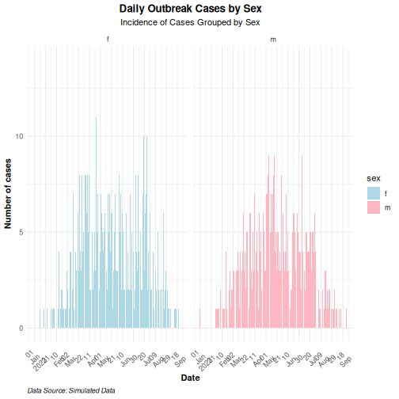

::::::::::::::::::::::


::::::::::::::::::::::::::::::::::::: keypoints

- Use the `{simulist}` package to generate synthetic outbreak data
- Use the `{incidence2}` package to aggregate case data based on a date event, and other variables to produce epidemic curves.
- Use the `{ggplot2}` package to produce better annotated epicurves.

::::::::::::::::::::::::::::::::::::::::::::::::
