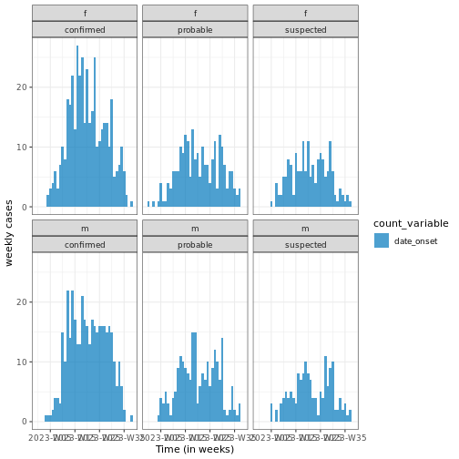

:::::::::::::::::::::::::::::::::::::: questions 

- How to aggregate case data? 
- How to visualize aggregated data?
- What is distribution of cases in time, place, gender, age?

::::::::::::::::::::::::::::::::::::::::::::::::

::::::::::::::::::::::::::::::::::::: objectives

- Simulate synthetic outbreak data
- Convert linelist data to incidence 
- Create epidemic curves from incidence data
::::::::::::::::::::::::::::::::::::::::::::::::

## Introduction

In an analytic pipeline, exploratory data analysis (EDA) is an important step before formal modelling. EDA helps 
determine relationships between variables and summarize their main characteristics often by means of data visualization. 

This episode focuses on  EDA of outbreaks and epidemic data, and how to achieved that using a couples of handy `R` 
packages. A key observation in EDA of epidemic analysis is capturing the relationship between time and the number of 
reported cases, spanning various categories (confirmed, hospitalized, deaths, and recoveries), locations, and other 
demographic factors such as gender, age, etc.  


::::::::::::::::::: checklist

### The double-colon

The double-colon `::` in R let you call a specific function from a package without loading the entire package into the current environment. 

For example, `dplyr::filter(data, condition)` uses `filter()` from the `{dplyr}` package.

This help us remember package functions and avoid namespace conflicts.

:::::::::::::::::::

 
## Synthetic outbreak data

To illustrate the process of conducting EDA on outbreak data, we will generate a line list 
for a hypothetical Ebola outbreak utilizing the `{simulist}` package. This line list dataset offers individual-level 
information about the outbreak. For our simulation, we will assume that the dynamics of this outbreak are influenced by 
several factors: the contact distribution (average number of contacts for an infected case), distribution of contact 
intervals (time period between contacts), and the delay distributions of onset to hospitalization and onset to death. 
These latter distributions can be sourced from literature and are conveniently available in the `{epiparameter}` 
package, see the below code chunk.


``` r
# Load simulist and epiparameter packages
library(simulist)
library(epiparameter)

# Define contact distribution
contact_dist <- epiparameter::epidist(
  disease = "Ebola",
  epi_dist = "contact distribution",
  prob_distribution = "pois",
  prob_distribution_params = c(mean = 2)
)

# Define  distribution for interval between contact
cont_interval <- epiparameter::epidist(
  disease = "Ebola",
  epi_dist = "contact interval",
  prob_distribution = "gamma",
  prob_distribution_params = c(shape = 1, scale = 1)
)

# Define onset to hospitalized distribution
onset_to_hosp <- contact_dist <- epiparameter::epidist(
  disease = "Ebola",
  epi_dist = "onset to hospitalisatio",
  prob_distribution = "pois",
  prob_distribution_params = c(mean = 7)
)

# get onset to death from {epiparameter} database
onset_to_death <- epiparameter::epidist_db(
  disease = "Ebola",
  epi_dist = "onset to death",
  single_epidist = TRUE
)

# Define distribution for infectious period
infect_period <- epiparameter::epidist(
  disease = "Ebola",
  epi_dist = "Infectious period",
  prob_distribution = "gamma",
  prob_distribution_params = c(shape = 1, scale = 1)
)
```
Additionally, we assume that the outbreak started at the beginning of 2023, is highly contagious with a probability of 
infection of $80\%$, and its minimum and maximum sizes are 1000 and 10,000, respectively. Combining these assumptions with 
the mentioned distributions, the code chunk below generates a simulated line list:

``` r
# Set seed to 1 to  have the same results
base::set.seed(1)

# Generate simulation data using the defined distribution.
linelist <- simulist::sim_linelist(
  contact_dist,
  infect_period,
  prob_infect = 0.6,
  onset_to_hosp,
  onset_to_death,
  hosp_risk = 0.2,
  hosp_death_risk = 0.5,
  non_hosp_death_risk = 0.05,
  outbreak_start_date = as.Date("2023-01-01"),
  outbreak_size = c(1000, 10000),
  population_age = c(1, 90),
  case_type_probs = c(suspected = 0.2, probable = 0.1, confirmed = 0.7),
  config = simulist::create_config()
)

# View first few rows of the generated data
utils::head(linelist)
```

``` output
  id         case_name case_type sex age date_onset date_admission   outcome
1  1  Yassir Hutchison confirmed   m   3 2023-01-01           <NA> recovered
2  6 Lubaaba el-Hameed confirmed   f  13 2023-01-01           <NA> recovered
3  7    Brandon Rivera confirmed   m  74 2023-01-01     2023-01-08 recovered
4  9      Sierra Quint confirmed   f  65 2023-01-01     2023-01-10      died
5 10          Levi Lee confirmed   m   8 2023-01-02           <NA> recovered
6 11       Nelson Tran suspected   m  27 2023-01-01           <NA> recovered
  date_outcome date_first_contact date_last_contact ct_value
1         <NA>               <NA>              <NA>       26
2         <NA>         2022-12-30        2023-01-02       26
3         <NA>         2022-12-31        2023-01-04       26
4   2023-01-01         2023-01-03        2023-01-04       26
5         <NA>         2022-12-31        2023-01-02       26
6         <NA>         2023-01-01        2023-01-05       NA
```
## Aggregating

Downstream analysis involves working with aggregated data rather than individual cases. This requires grouping linelist 
data in the form of incidence data. The [incidence2]((https://www.reconverse.org/incidence2/articles/incidence2.html){.external target="_blank"}) 
package offers an essential function, called `incidence`, for grouping case data, usually centered around dated events 
and/or other factors. The code chunk provided below demonstrates the creation of an `incidence2` object from the 
simulated  Ebola `linelist` data based on the  date of onset.


``` r
# load incidence2 package
library(incidence2)

# create incidence object by aggregating case data  based on the date of onset
dialy_incidence_data <- incidence2::incidence(
  linelist,
  date_index = "date_onset",
  interval = 1
)

# View the first incidence data for the first 5 days
utils::head(dialy_incidence_data, 5)
```

``` output
# incidence:  5 x 3
# count vars: date_onset
  date_index count_variable count
  <period>   <chr>          <int>
1 2023-01-01 date_onset       475
2 2023-01-02 date_onset      4904
3 2023-01-03 date_onset      5478
4 2023-01-04 date_onset      5319
5 2023-01-05 date_onset      3520
```
Furthermore, with the `{incidence2}` package, you can specify the desired interval and categorize cases by one or 
more factors. Below is a code snippet demonstrating weekly cases grouped by the date of onset and gender.


``` r
# Grouping data by week
weekly_incidence_data <- incidence2::incidence(
  linelist,
  date_index = "date_onset",
  interval = 7,
  groups = c("sex", "case_type")
)

# View incidence data for the first 5 weeks
utils::head(weekly_incidence_data, 5)
```

``` output
# incidence:  5 x 5
# count vars: date_onset
# groups:     sex, case_type
  date_index               sex   case_type count_variable count
  <period>                 <chr> <chr>     <chr>          <int>
1 2022-12-29 to 2023-01-04 f     confirmed date_onset      5558
2 2022-12-29 to 2023-01-04 f     probable  date_onset       771
3 2022-12-29 to 2023-01-04 f     suspected date_onset      1625
4 2022-12-29 to 2023-01-04 m     confirmed date_onset      5764
5 2022-12-29 to 2023-01-04 m     probable  date_onset       800
```

::::::::::::::::::::::::::::::::::::: callout
## Notes 
When cases are grouped by different factors, it's possible that these groups may have different date ranges in the 
resulting `incidence2` object. The `incidence2` package provides a function called `complete_dates()` to ensure that an
 incidence object has the same range of dates for each group. By default, missing counts will be filled with 0.


``` r
# Create incidence object
dialy_incidence_data_2 <- incidence2::incidence(
  linelist,
  date_index = "date_onset",
  groups = "sex",
  interval = 1
)

# Complete missing dates in the incidence object
incidence2::complete_dates(
  x = dialy_incidence_data_2,
  expand = TRUE,
  fill = 0L, by = 1L,
  allow_POSIXct = FALSE
)
```

``` output
# incidence:  24 x 4
# count vars: date_onset
# groups:     sex
   date_index sex   count_variable count
   <period>   <chr> <chr>          <int>
 1 2023-01-01 f     date_onset       242
 2 2023-01-01 m     date_onset       233
 3 2023-01-02 f     date_onset      2403
 4 2023-01-02 m     date_onset      2501
 5 2023-01-03 f     date_onset      2709
 6 2023-01-03 m     date_onset      2769
 7 2023-01-04 f     date_onset      2600
 8 2023-01-04 m     date_onset      2719
 9 2023-01-05 f     date_onset      1763
10 2023-01-05 m     date_onset      1757
# ℹ 14 more rows
```
::::::::::::::::::::::::::::::::::::::::::::::::

## Visualization

"The `incidence2` object can be visualized using the `plot()` function from the base R package. 
The resulting graph is referred to as an epidemic curve, or epi-curve for short. The following code 
snippets generate epi-curves for the `dialy_incidence_data` and `weekly_incidence_data` incidence objects mentioned above."


``` r
# Load ggplot2 and tracetheme packages
library(ggplot2)
library(tracetheme)

# Plot daily incidence data
base::plot(dialy_incidence_data) +
  ggplot2::labs(
    x = "Time (in days)",
    y = "Dialy cases"
  ) +
  tracetheme::theme_trace()
```


``` r
# Plot weekly incidence data

base::plot(weekly_incidence_data) +
  ggplot2::labs(
    x = "Time (in weeks)",
    y = "weekly cases"
  ) +
  tracetheme::theme_trace()
```


## Curve of cumulative cases

The cumulative number of cases can be calculated using the `cumulate()` function from an `incidence2` object and visualized, as in the example below.


``` r
cum_df <- incidence2::cumulate(dialy_incidence_data)
base::plot(cum_df) +
  ggplot2::labs(
    x = "Time (in days)",
    y = "weekly cases"
  ) +
  tracetheme::theme_trace()
```



Note that this function preserves grouping, i.e., if the `incidence2` object contains groups, it will accumulate the cases accordingly. Give it a try with the `weekly_incidence_data` object!

##  Peak estimation

One can estimate the peak --the time with the highest number of recorded cases-- using the `estimate_peak()` function from the {incidence2} package. 
This function employs a bootstrapping method to determine the peak time.


``` r
peak <- incidence2::estimate_peak(
  dialy_incidence_data,
  n = 100,
  alpha = 0.05,
  first_only = TRUE,
  progress = FALSE
)
print(peak)
```

``` output
# A tibble: 1 × 7
  count_variable observed_peak observed_count bootstrap_peaks lower_ci   median 
  <chr>          <period>               <int> <list>          <period>   <perio>
1 date_onset     2023-01-03              5478 <df [100 × 1]>  2023-01-03 2023-0…
# ℹ 1 more variable: upper_ci <period>
```
This example demonstrates how to estimate the peak time using the `estimate_peak()` function at $95%$ 
confidence interval and using 100 bootstrap samples. 

## Visulaziantion with ggplot2


`{incidence2}` produces basic plots for epicurves, but additional work is required to create well-annotated graphs. However, using the `{ggplot2}` package, you can generate more sophisticated and better-annotated epicurves.
`{ggplot2}` is a comprehensive package with many functionalities. However, we will focus on three key elements for producing epicurves: histogram plots, scaling date axes and their labels, and general plot theme annotation.
The example below demonstrates how to configure these three elements for a simple `{incidence2}` object.


``` r
breaks <- seq.Date(
  from = min(as.Date(dialy_incidence_data$date_index,
    na.rm = TRUE
  )),
  to = as.Date(max(dialy_incidence_data$date_index,
    na.rm = TRUE
  )),
  by = 1
)

ggplot2::ggplot(data = dialy_incidence_data) +
  geom_histogram(
    mapping = aes(
      x = as.Date(date_index),
      y = count
    ),
    stat = "identity",
    color = "blue",
    width = 1
  ) +
  theme_minimal() + # simple theme
  theme(
    plot.title = element_text(face = "bold", hjust = 0.5),
    plot.caption = element_text(face = "italic", hjust = 0),
    axis.title = element_text(face = "bold"),
    axis.text.x = element_text(angle = 45)
  ) +
  labs(
    x = "Date", # x-label
    y = "Number of cases", # y-label,
    title = "Daily outbreak cases", # title
    subtitle = "subtitle", # subtitle
    caption = "informative caption"
  ) +
  scale_x_date(
    breaks = breaks,
    label = scales::label_date_short()
  )
```


Use the `group` option in the mapping function to visualize an epicurve with different groups. If there is more than one grouping factor, use the `facet_wrap()` option, as demonstrated in the example below:


``` r
ggplot2::ggplot(data = dialy_incidence_data_2) +
  geom_histogram(
    mapping = aes(
      x = as.Date(date_index),
      y = count,
      group = sex,
      fill = sex
    ),
    stat = "identity"
  ) +
  theme_minimal() + # simple theme
  theme(
    plot.title = element_text(face = "bold", hjust = 0.5),
    plot.caption = element_text(face = "italic", hjust = 0),
    axis.title = element_text(face = "bold"),
    axis.text.x = element_text(angle = 45)
  ) +
  labs(
    x = "Date", # x-label
    y = "Number of cases", # y-label,
    title = "Daily outbreak cases", # title
    subtitle = "subtitle", # subtitle
    caption = "informative caption"
  ) +
  facet_wrap(~sex) +
  scale_x_date(
    breaks = breaks,
    label = scales::label_date_short()
  )
```


::::::::::::::::::::::::::::::::::::: challenge 

## Challenge 1: Can you do it?

 - Using suitable distributions for contacts, contact interval, infectious period, onset to hospitalized, and onset to 
 death, generate a simulated linelist data for  Marburg outbreak that has the probability of $0.5$ infection?
 - Aggregate the generated linelist and produce some epidemic curves?

::::::::::::::::::::::::::::::::::::::::::::::::

::::::::::::::::::::::::::::::::::::: keypoints 

- Use `{simulist}` package to generate synthetic outbreak data
- Use `{incidence2}` package to aggregate case data based on a date event, and produce epidemic curves. 

::::::::::::::::::::::::::::::::::::::::::::::::
