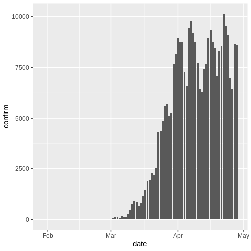
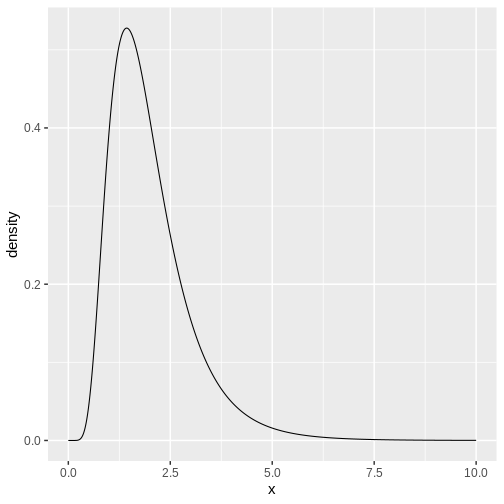
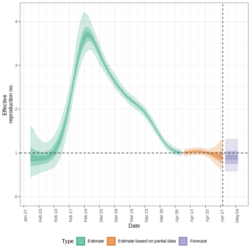
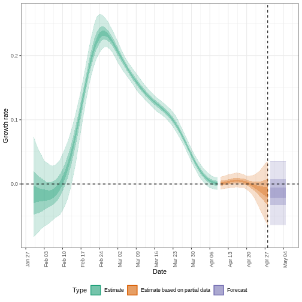
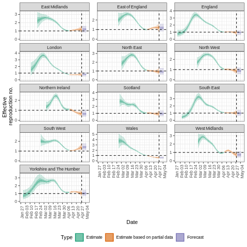

:::::::::::::::::::::::::::::::::::::: questions 

- How can I estimate the time-varying reproduction number ($Rt$) and growth rate from a time series of case data?
- How can I quantify geographical heterogeneity from these transmission metrics? 


::::::::::::::::::::::::::::::::::::::::::::::::

::::::::::::::::::::::::::::::::::::: objectives

- Learn how to estimate transmission metrics from a time series of case data using the R package `EpiNow2`

::::::::::::::::::::::::::::::::::::::::::::::::

::::::::::::::::::::::::::::::::::::: prereq

## Prerequisites

Learners should familiarise themselves with following concepts before working through this tutorial: 

**Statistics**: probability distributions, principle of Bayesian analysis. 

**Epidemic theory**: Effective reproduction number.

:::::::::::::::::::::::::::::::::


::::::::::::::::::::::::::::::::::::: callout
### Reminder: the Effective Reproduction Number, $R_t$ 

The [basic reproduction number](../learners/reference.md#basic), $R_0$, is the average number of cases caused by one infectious individual in a entirely susceptible population. 

But in an ongoing outbreak, the population does not remain entirely susceptible as those that recover from infection are typically immune. Moreover, there can be changes in behaviour or other factors that affect transmission. When we are interested in monitoring changes in transmission we are therefore more interested in the value of the **effective reproduction number**, $R_t$, the average number of cases caused by one infectious individual in the population at time $t$.

::::::::::::::::::::::::::::::::::::::::::::::::


## Introduction

The transmission intensity of an outbreak is quantified using two key metrics: the reproduction number, which informs on the strength of the transmission by indicating how many new cases are expected from each existing case; and the [growth rate](../learners/reference.md#growth), which informs on the speed of the transmission by indicating how rapidly the outbreak is spreading or declining (doubling/halving time) within a population. For more details on the distinction between speed and strength of transmission and implications for control, review [Dushoff & Park, 2021](https://royalsocietypublishing.org/doi/full/10.1098/rspb.2020.1556).

To estimate these key metrics using case data we must account for delays between the date of infections and date of reported cases. In an outbreak situation, data are usually available on reported dates only, therefore we must use estimation methods to account for these delays when trying to understand changes in transmission over time.

In the next tutorials we will focus on how to use the functions in `{EpiNow2}` to estimate transmission metrics of case data. We will not cover the theoretical background of the models or inference framework, for details on these concepts see the [vignette](https://epiforecasts.io/EpiNow2/dev/articles/estimate_infections.html).

In this tutorial we are going to learn how to use the `{EpiNow2}` package to estimate the time-varying reproduction number. We’ll use the `{dplyr}` package to arrange some of its inputs, `{ggplot2}` to visualize case distribution, and the pipe `%>%` to connect some of their functions, so let’s also call to the `{tidyverse}` package:


```r
library(EpiNow2)
library(tidyverse)
```

::::::::::::::::::: checklist

### The double-colon

The double-colon `::` in R is used to access functions or objects from a specific package without loading the entire package into the current environment. This allows for a more targeted approach to using package components and helps avoid namespace conflicts.

`::` lets you call a specific function from a package by explicitly mentioning the package name. For example, `dplyr::filter(data, condition)` uses `filter()` from the `{dplyr}` package without loading the entire package.

:::::::::::::::::::

:::::::::::::::::::::::::::::::::::::::::::::::::::::::::::::::::::: instructor

This tutorial illustrates the usage of `epinow()` to estimate the time-varying reproduction number and infection times. Learners should understand the necessary inputs to the model and the limitations of the model output. 

::::::::::::::::::::::::::::::::::::::::::::::::::::::::::::::::::::::::::::::::


::::::::::::::::::::::::::::::::::::: callout
### Bayesian inference

The R package `EpiNow2` uses a [Bayesian inference](../learners/reference.md#bayesian) framework to estimate reproduction numbers and infection times based on reporting dates.

In Bayesian inference, we use prior knowledge (prior distributions) with data (in a likelihood function) to find the posterior probability.

<p class="text-center" style="background-color: white">Posterior probability $\propto$ likelihood $\times$ prior probability
</p>

::::::::::::::::::::::::::::::::::::::::::::::::

:::::::::::::::::::::::::::::::::::::::::::::::: instructor

Refer to the prior probability distribution and the [posterior probability](https://en.wikipedia.org/wiki/Posterior_probability) distribution.

In the ["`Expected change in daily cases`" callout](#expected-change-in-daily-cases), by "the posterior probability that $R_t < 1$", we refer specifically to the [area under the posterior probability distribution curve](https://www.nature.com/articles/nmeth.3368/figures/1). 

::::::::::::::::::::::::::::::::::::::::::::::::


## Delay distributions and case data 
### Case data

To illustrate the functions of `EpiNow2` we will use outbreak data of the start of the COVID-19 pandemic from the United Kingdom. The data are available in the R package `{incidence2}`. 


```r
dplyr::as_tibble(incidence2::covidregionaldataUK)
```

```{.output}
# A tibble: 6,370 × 13
   date       region   region_code cases_new cases_total deaths_new deaths_total
   <date>     <chr>    <chr>           <dbl>       <dbl>      <dbl>        <dbl>
 1 2020-01-30 East Mi… E12000004          NA          NA         NA           NA
 2 2020-01-30 East of… E12000006          NA          NA         NA           NA
 3 2020-01-30 England  E92000001           2           2         NA           NA
 4 2020-01-30 London   E12000007          NA          NA         NA           NA
 5 2020-01-30 North E… E12000001          NA          NA         NA           NA
 6 2020-01-30 North W… E12000002          NA          NA         NA           NA
 7 2020-01-30 Norther… N92000002          NA          NA         NA           NA
 8 2020-01-30 Scotland S92000003          NA          NA         NA           NA
 9 2020-01-30 South E… E12000008          NA          NA         NA           NA
10 2020-01-30 South W… E12000009          NA          NA         NA           NA
# ℹ 6,360 more rows
# ℹ 6 more variables: recovered_new <dbl>, recovered_total <dbl>,
#   hosp_new <dbl>, hosp_total <dbl>, tested_new <dbl>, tested_total <dbl>
```

To use the data, we must format the data to have two columns:

+ `date`: the date (as a date object see `?is.Date()`),
+ `confirm`: number of confirmed cases on that date.

Let's use `{dplyr}` for this:


```r
library(dplyr)

cases <- incidence2::covidregionaldataUK %>%
  select(date, cases_new) %>%
  group_by(date) %>%
  summarise(confirm = sum(cases_new, na.rm = TRUE)) %>%
  ungroup()
```

::::::::::::::::::::::::: spoiler

### When to use incidence2?

We can also use the `{incidence2}` package to:

- Aggregate cases (similar to the code above) but in different time *intervals* (i.e., days, weeks or months) or per *group* categories. Explore later the [`incidence2::incidence()` reference manual](https://www.reconverse.org/incidence2/reference/incidence.html).

- Complete dates for all the range of dates per group category using `incidence2::complete_dates()`. Read further in its [function reference manual](https://www.reconverse.org/incidence2/reference/complete_dates.html).


```r
library(tidyr)
library(dplyr)

incidence2::covidregionaldataUK %>%
  # preprocess missing values
  tidyr::replace_na(list(cases_new = 0)) %>%
  # compute the daily incidence
  incidence2::incidence(
    date_index = "date",
    counts = "cases_new",
    count_values_to = "confirm",
    date_names_to = "date"
  ) %>%
  # complete range of dates
  incidence2::complete_dates()
```

:::::::::::::::::::::::::

There are case data available for 490 days, but in an outbreak situation it is likely we would only have access to the beginning of this data set. Therefore we assume we only have the first 90 days of this data. 




### Delay distributions 
We assume there are delays from the time of infection until the time a case is reported. We specify these delays as distributions to account for the uncertainty in individual level differences. The delay can consist of multiple types of delays/processes. A typical delay from time of infection to case reporting may consist of:

<p class="text-center" style="background-color: aliceblue">**time from infection to symptom onset** (the [incubation period](../learners/reference.md#incubation)) + **time from symptom onset to case notification** (the reporting time)
.</p>

The delay distribution for each of these processes can either estimated from data or obtained from the literature. We can express uncertainty about what the correct parameters of the distributions by assuming the distributions have **fixed** parameters or whether they have **variable** parameters. To understand the difference between **fixed** and **variable** distributions, let's consider the incubation period. 

::::::::::::::::::::::::::::::::::::: callout
### Delays and data
The number of delays and type of delay are a flexible input that depend on the data. The examples below highlight how the delays can be specified for different data sources:

<center>

| Data source        | Delay(s) |
| ------------- |-------------|
|Time of symptom onset      |Incubation period |
|Time of case report      |Incubation period + time from symptom onset to case notification |
|Time of hospitalisation   |Incubation period + time from symptom onset to hospitalisation     |

</center>


::::::::::::::::::::::::::::::::::::::::::::::::


#### Incubation period distribution 

The distribution of incubation period for many diseases can usually be obtained from the literature. The package `{epiparameter}` contains a library of epidemiological parameters for different diseases obtained from the literature. 

We specify a (fixed) gamma distribution with mean $\mu = 4$ and standard deviation $\sigma= 2$ (shape = $4$, scale = $1$) using the function `dist_spec()` as follows:


```r
incubation_period_fixed <- dist_spec(
  mean = 4, sd = 2,
  max = 20, distribution = "gamma"
)
incubation_period_fixed
```

```{.output}

  Fixed distribution with PMF [0.019 0.12 0.21 0.21 0.17 0.11 0.069 0.039 0.021 0.011 0.0054 0.0026 0.0012 0.00058 0.00026 0.00012 5.3e-05 2.3e-05 1e-05 4.3e-06]
```

The argument `max` is the maximum value the distribution can take, in this example 20 days. 

::::::::::::::::::::::::::::::::::::: callout
### Why a gamma distrubution? 

The incubation period has to be positive in value. Therefore we must specific a distribution in `dist_spec` which is for positive values only. 

`dist_spec()` supports log normal and gamma distributions, which are distributions for positive values only. 

For all types of delay, we will need to use distributions for positive values only - we don't want to include delays of negative days in our analysis!

::::::::::::::::::::::::::::::::::::::::::::::::


####  Including distribution uncertainty

To specify a **variable** distribution, we include uncertainty around the mean $\mu$ and standard deviation $\sigma$ of our gamma distribution. If our incubation period distribution has a mean $\mu$ and standard deviation $\sigma$, then we assume the mean ($\mu$) follows a Normal distribution with standard deviation $\sigma_{\mu}$:

$$\mbox{Normal}(\mu,\sigma_{\mu}^2)$$

and a standard deviation ($\sigma$) follows a Normal distribution with standard deviation $\sigma_{\sigma}$:

$$\mbox{Normal}(\sigma,\sigma_{\sigma}^2).$$

We specify this using `dist_spec` with the additional arguments `mean_sd` ($\sigma_{\mu}$) and `sd_sd` ($\sigma_{\sigma}$).


```r
incubation_period_variable <- dist_spec(
  mean = 4, sd = 2,
  mean_sd = 0.5, sd_sd = 0.5,
  max = 20, distribution = "gamma"
)
incubation_period_variable
```

```{.output}

  Uncertain gamma distribution with (untruncated) mean 4 (SD 0.5) and SD 2 (SD 0.5)
```


####  Reporting delays

After the incubation period, there will be an additional delay of time from symptom onset to case notification: the reporting delay. We can specify this as a fixed or variable distribution, or estimate a distribution from data. 

When specifying a distribution, it is useful to visualise the probability density to see the peak and spread of the distribution, in this case we will use a log normal distribution. We can use the functions `convert_to_logmean()` and `convert_to_logsd()` to  convert the mean and standard deviation of a normal distribution to that of a log normal distribution. 

If we want to assume that the mean reporting delay is 2 days (with a standard deviation of 1 day), the log normal distribution will look like: 


```r
log_mean <- convert_to_logmean(2, 1)
log_sd <- convert_to_logsd(2, 1)
x <- seq(from = 0, to = 10, length = 1000)
df <- data.frame(x = x, density = dlnorm(x, meanlog = log_mean, sdlog = log_sd))
ggplot(df) +
  geom_line(
    aes(x, density)
  ) +
  theme_grey(
    base_size = 15
  )
```



Using the mean and standard deviation for the log normal distribution, we can specify a fixed or variable distribution using `dist_spec()` as before: 


```r
reporting_delay_variable <- dist_spec(
  mean = log_mean, sd = log_sd,
  mean_sd = 0.5, sd_sd = 0.5,
  max = 10, distribution = "lognormal"
)
```

If data is available on the time between symptom onset and reporting, we can use the function `estimate_delay()` to estimate a log normal distribution from a vector of delays. The code below illustrates how to use `estimate_delay()` with synthetic delay data. 


```r
delay_data <- rlnorm(500, log(5), 1) # synthetic delay data
reporting_delay <- estimate_delay(
  delay_data,
  samples = 1000,
  bootstraps = 10
)
```


####  Generation time

We also must specify a distribution for the generation time. Here we will use a log normal distribution with mean 3.6 and standard deviation 3.1 ([Ganyani et al. 2020](https://doi.org/10.2807/1560-7917.ES.2020.25.17.2000257)).


```r
generation_time_variable <- dist_spec(
  mean = 3.6, sd = 3.1,
  mean_sd = 0.5, sd_sd = 0.5,
  max = 20, distribution = "lognormal"
)
```


## Finding estimates

The function `epinow()` is a wrapper for the function `estimate_infections()` used to estimate cases by date of infection. The generation time distribution and delay distributions must be passed using the functions ` generation_time_opts()` and `delay_opts()` respectively. 

There are numerous other inputs that can be passed to `epinow()`, see `EpiNow2::?epinow()` for more detail.
One optional input is to specify a log normal prior for the effective reproduction number $R_t$ at the start of the outbreak. We specify a mean and standard deviation as arguments of `prior` within `rt_opts()`:


```r
rt_log_mean <- convert_to_logmean(2, 1)
rt_log_sd <- convert_to_logsd(2, 1)
rt <- rt_opts(prior = list(mean = rt_log_mean, sd = rt_log_sd))
```

::::::::::::::::::::::::::::::::::::: callout
### Bayesian inference using Stan 

The Bayesian inference is performed using MCMC methods with the program [Stan](https://mc-stan.org/). There are a number of default inputs to the Stan functions including the number of chains and number of samples per chain (see `?EpiNow2::stan_opts()`).

To reduce computation time, we can run chains in parallel. To do this, we must set the number of cores to be used. By default, 4 MCMC chains are run (see `stan_opts()$chains`), so we can set an equal number of cores to be used in parallel as follows:


```r
withr::local_options(list(mc.cores = 4))
```

To find the maximum number of available cores on your machine, use `parallel::detectCores()`.

::::::::::::::::::::::::::::::::::::::::::::::::

::::::::::::::::::::::::: checklist

**Note:** In the code below `_fixed` distributions are used instead of `_variable` (delay distributions with uncertainty). This is to speed up computation time. It is generally recommended to use variable distributions that account for additional uncertainty.


```r
# fixed alternatives
generation_time_fixed <- dist_spec(
  mean = 3.6, sd = 3.1,
  max = 20, distribution = "lognormal"
)

reporting_delay_fixed <- dist_spec(
  mean = log_mean, sd = log_sd,
  max = 10, distribution = "lognormal"
)
```

:::::::::::::::::::::::::

Now you are ready to run `EpiNow2::epinow()` to estimate the time-varying reproduction number:


```r
reported_cases <- cases[1:90, ]

estimates <- epinow(
  # cases
  reported_cases = reported_cases,
  # delays
  generation_time = generation_time_opts(generation_time_fixed),
  delays = delay_opts(incubation_period_fixed + reporting_delay_fixed),
  # prior
  rt = rt_opts(prior = list(mean = rt_log_mean, sd = rt_log_sd)),
  # computation (optional)
  stan = stan_opts(samples = 1000, chains = 3)
)
```

```{.output}
WARN [2024-05-21 01:20:03] epinow: Bulk Effective Samples Size (ESS) is too low, indicating posterior means and medians may be unreliable.
Running the chains for more iterations may help. See
https://mc-stan.org/misc/warnings.html#bulk-ess - 
```

::::::::::::::::::::::::::::::::: callout

### Do not wait for this to continue

Using `stan = stan_opts()` is optional. For the purpose of this tutorial on reducing computation time, we specified a fixed number of `samples = 1000` and `chains = 3` to the `stan` argument using the `stan_opts()` function. We expect this to take approximately 3 minutes.

**Remember:** Using an appropriate number of *samples* and *chains* is crucial for ensuring convergence and obtaining reliable estimates in Bayesian computations using Stan. Inadequate sampling or insufficient chains may lead to issues such as divergent transitions, impacting the accuracy and stability of the inference process.

:::::::::::::::::::::::::::::::::

### Results

We can extract and visualise estimates of the effective reproduction number through time:


```r
estimates$plots$R
```



The uncertainty in the estimates increases through time. This is because estimates are informed by data in the past - within the delay periods. This difference in uncertainty is categorised into **Estimate** (green) utilises all data and **Estimate based on partial data** (orange) estimates that are based on less data (because infections that happened at the time are more likely to not have been observed yet) and therefore have increasingly wider intervals towards the date of the last data point. Finally, the **Forecast** (purple) is a projection ahead of time. 

We can also visualise the growth rate estimate through time: 

```r
estimates$plots$growth_rate
```



To extract a summary of the key transmission metrics at the *latest date* in the data:


```r
summary(estimates)
```

```{.output}
                                 measure                 estimate
                                  <char>                   <char>
1: New confirmed cases by infection date     7286 (4100 -- 12479)
2:        Expected change in daily cases        Likely decreasing
3:            Effective reproduction no.       0.89 (0.58 -- 1.3)
4:                        Rate of growth -0.014 (-0.062 -- 0.038)
5:          Doubling/halving time (days)          -48 (18 -- -11)
```

As these estimates are based on partial data, they have a wide uncertainty interval.

+ From the summary of our analysis we see that the expected change in daily cases is Likely decreasing with the estimated new confirmed cases 7286 (4100 -- 12479).

+ The effective reproduction number $R_t$ estimate (on the last date of the data) is 0.89 (0.58 -- 1.3). 

+ The exponential growth rate of case numbers is -0.014 (-0.062 -- 0.038).

+ The doubling time (the time taken for case numbers to double) is -48 (18 -- -11).

::::::::::::::::::::::::::::::::::::: callout
### `Expected change in daily cases` 

A factor describing expected change in daily cases based on the posterior probability that $R_t < 1$.

<center>
| Probability ($p$)      | Expected change |
| ------------- |-------------|
|$p < 0.05$    |Increasing |
|$0.05 \leq p< 0.4$    |Likely increasing |
|$0.4 \leq p< 0.6$    |Stable |
|$0.6 \leq p < 0.95$    |Likely decreasing |
|$0.95 \leq p \leq 1$    |Decreasing |
</center>

::::::::::::::::::::::::::::::::::::::::::::::::


## Quantify geographical heterogeneity

The outbreak data of the start of the COVID-19 pandemic from the United Kingdom from the R package `{incidence2}` includes the region in which the cases were recorded. To find regional estimates of the effective reproduction number and cases, we must format the data to have three columns:

+ `date`: the date,
+ `region`: the region, 
+ `confirm`: number of confirmed cases for a region on a given date.


```r
regional_cases <-
  incidence2::covidregionaldataUK[, c("date", "cases_new", "region")]
colnames(regional_cases) <- c("date", "confirm", "region")

# extract the first 90 dates for all regions
dates <- sort(unique(regional_cases$date))[1:90]
regional_cases <- regional_cases[which(regional_cases$date %in% dates), ]

head(regional_cases)
```

```{.output}
        date confirm          region
1 2020-01-30      NA   East Midlands
2 2020-01-30      NA East of England
3 2020-01-30       2         England
4 2020-01-30      NA          London
5 2020-01-30      NA      North East
6 2020-01-30      NA      North West
```

To find regional estimates, we use the same inputs as `epinow()` to the function `regional_epinow()`:


```r
estimates_regional <- regional_epinow(
  # cases
  reported_cases = regional_cases,
  # delays
  generation_time = generation_time_opts(generation_time_fixed),
  delays = delay_opts(incubation_period_fixed + reporting_delay_fixed),
  # prior
  rt = rt_opts(prior = list(mean = rt_log_mean, sd = rt_log_sd))
)
```

```{.output}
INFO [2024-05-21 01:20:06] Producing following optional outputs: regions, summary, samples, plots, latest
INFO [2024-05-21 01:20:06] Reporting estimates using data up to: 2020-04-28
INFO [2024-05-21 01:20:06] No target directory specified so returning output
INFO [2024-05-21 01:20:06] Producing estimates for: East Midlands, East of England, England, London, North East, North West, Northern Ireland, Scotland, South East, South West, Wales, West Midlands, Yorkshire and The Humber
INFO [2024-05-21 01:20:06] Regions excluded: none
INFO [2024-05-21 02:04:47] Completed regional estimates
INFO [2024-05-21 02:04:47] Regions with estimates: 13
INFO [2024-05-21 02:04:47] Regions with runtime errors: 0
INFO [2024-05-21 02:04:47] Producing summary
INFO [2024-05-21 02:04:47] No summary directory specified so returning summary output
INFO [2024-05-21 02:04:48] No target directory specified so returning timings
```

```r
estimates_regional$summary$summarised_results$table
```

```{.output}
                      Region New confirmed cases by infection date
                      <char>                                <char>
 1:            East Midlands                      346 (214 -- 564)
 2:          East of England                      547 (328 -- 852)
 3:                  England                   3564 (2172 -- 5589)
 4:                   London                      295 (187 -- 453)
 5:               North East                      252 (150 -- 428)
 6:               North West                      554 (333 -- 892)
 7:         Northern Ireland                         44 (23 -- 82)
 8:                 Scotland                      289 (163 -- 531)
 9:               South East                      587 (352 -- 993)
10:               South West                      418 (291 -- 606)
11:                    Wales                        96 (67 -- 139)
12:            West Midlands                      276 (153 -- 489)
13: Yorkshire and The Humber                      481 (285 -- 786)
    Expected change in daily cases Effective reproduction no.
                            <fctr>                     <char>
 1:              Likely increasing          1.2 (0.86 -- 1.6)
 2:              Likely increasing          1.2 (0.83 -- 1.6)
 3:              Likely decreasing         0.92 (0.63 -- 1.3)
 4:              Likely decreasing         0.79 (0.55 -- 1.1)
 5:              Likely decreasing         0.91 (0.61 -- 1.3)
 6:              Likely decreasing         0.87 (0.58 -- 1.2)
 7:              Likely decreasing           0.65 (0.39 -- 1)
 8:              Likely decreasing          0.92 (0.6 -- 1.4)
 9:                         Stable         0.99 (0.67 -- 1.4)
10:                     Increasing           1.4 (1.1 -- 1.8)
11:                     Decreasing        0.57 (0.43 -- 0.77)
12:              Likely decreasing         0.71 (0.45 -- 1.1)
13:                         Stable             1 (0.7 -- 1.4)
               Rate of growth Doubling/halving time (days)
                       <char>                       <char>
 1:   0.024 (-0.019 -- 0.068)               29 (10 -- -36)
 2:   0.023 (-0.023 -- 0.066)               30 (10 -- -30)
 3:  -0.011 (-0.054 -- 0.033)              -62 (21 -- -13)
 4: -0.029 (-0.068 -- 0.0093)              -24 (74 -- -10)
 5:  -0.012 (-0.057 -- 0.037)              -58 (19 -- -12)
 6:  -0.018 (-0.062 -- 0.023)              -38 (30 -- -11)
 7:   -0.051 (-0.1 -- 0.0039)            -14 (180 -- -6.9)
 8:  -0.011 (-0.059 -- 0.045)              -65 (15 -- -12)
 9: -0.0013 (-0.047 -- 0.049)             -530 (14 -- -15)
10:    0.047 (0.012 -- 0.085)               15 (8.1 -- 59)
11:  -0.063 (-0.09 -- -0.032)            -11 (-21 -- -7.7)
12:   -0.04 (-0.087 -- 0.013)             -17 (54 -- -7.9)
13:  0.0032 (-0.043 -- 0.051)              210 (14 -- -16)
```

```r
estimates_regional$summary$plots$R
```



:::::::::::::::::::::::::: testimonial

### the i2extras package

`{i2extras}` package also estimate transmission metrics like growth rate and doubling/halving time at different time intervals (i.e., days, weeks, or months). `{i2extras}` require `{incidence2}` objects as inputs. Read further in its [Fitting curves](https://www.reconverse.org/i2extras/articles/fitting_epicurves.html) vignette.

::::::::::::::::::::::::::

## Summary

`EpiNow2` can be used to estimate transmission metrics from case data at any time in the course of an outbreak. The reliability of these estimates depends on the quality of the data and appropriate choice of delay distributions. In the next tutorial we will learn how to make forecasts and investigate some of the additional inference options available in `EpiNow2`. 

::::::::::::::::::::::::::::::::::::: keypoints 

- Transmission metrics can be estimated from case data after accounting for delays
- Uncertainty can be accounted for in delay distributions

::::::::::::::::::::::::::::::::::::::::::::::::
