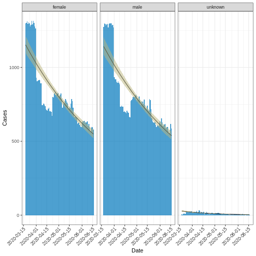

:::::::::::::::::::::::::::::::::::::: questions 

- What is the growth rate of the epidemic?
- How to identify the peak time of an outbreak?
- How to compute moving average of cases?

::::::::::::::::::::::::::::::::::::::::::::::::

::::::::::::::::::::::::::::::::::::: objectives

- Perform an early analysis of outbreak data
- Identify trends, exponential, doubling, and peak time

::::::::::::::::::::::::::::::::::::::::::::::::

## Introduction

Understanding the trend in case data is crucial for various purposes, such as forecasting future case counts, implementing public health interventions, and assessing the effectiveness of control measures. By analyzing the trend, policymakers and public health experts can make informed decisions to mitigate the spread of diseases and protect public health. This episode focuses on how to perform a simple early analysis on incidence data. It uses the same dataset of **Covid-19 case data from England** that utilized it in [Aggregate and visualize](../episodes/describe-cases.Rmd) episode. 

## Simple model

Aggregated case data over a specific time unit, or incidence data, typically represent the number of cases occurring within that time frame. These data can often be assumed to follow either `Poisson distribution` or a `negative binomial (NB) distribution`, depending on the specific characteristics of the data and the underlying processes generating them. When analyzing such data, one common approach is to examine the trend over time by computing the rate of change, which can indicate whether there is exponential growth or decay in the number of cases. Exponential growth implies that the number of cases is increasing at an accelerating rate over time, while exponential decay suggests that the number of cases is decreasing at a decelerating rate.

The `i2extras` package provides methods for modelling the trend in case data, calculating moving averages, and exponential growth or decay rate. The code chunk below computes the Covid-19 trend in UK within first 3 months using negative binomial distribution. 


```r
# loads the i2extras package, which provides methods for modeling
library("i2extras")
# This line loads the i2extras package, which provides methods for modeling
library("incidence2")
# subset the covid19_eng_case_data to include only the first 3 months of data
covid19_eng_case_data <- outbreaks::covid19_england_nhscalls_2020
df <- base::subset(
  covid19_eng_case_data,
  covid19_eng_case_data$date <= min(covid19_eng_case_data$date) + 90
)
# uses the incidence function from the incidence2 package to compute the
# incidence data
df_incid <- incidence2::incidence(df, date_index = "date", groups = "sex")

# fit a curve to the incidence data. The model chosen is the negative binomial
# distribution with a significance level (alpha) of 0.05.
fitted_curve_nb <- i2extras::fit_curve(df_incid, model = "negbin", alpha = 0.05)
base::plot(fitted_curve_nb, angle = 45) + ggplot2::labs(x = "Date", y = "Cases")
```




::::::::::::::::::::::::::::::::::::: challenge 

## Challenge 1: Poission distribution

Repeat the above analysis using Poisson distribution?

:::::::::::::::::::::::: solution 


```r
fitted_curve_poisson <- i2extras::fit_curve(df_incid, model = "poisson",
                                            alpha = 0.05)
base::plot(fitted_curve_poisson, angle = 45) +
  ggplot2::labs(x = "Date", y = "Cases")
```


:::::::::::::::::::::::::::::::::
::::::::::::::::::::::::::::::::::::::::::::::::

## Exponential growth or decay rate

The exponential growth or decay rate, denoted as $r$, serves as an indicator for the trend in cases, indicating whether they are increasing (growth) or decreasing (decay) on an exponential scale. This rate is computed using the so-called  **renewal equation** [(Wallinga et al. 2006)](https://royalsocietypublishing.org/doi/10.1098/rspb.2006.3754), which mechanistically links the reproductive number $R$ of new cases to the generation interval of the disease. This computational method is implemented in the `{i2extras}` package.

Below is a code snippet demonstrating how to extract the growth/decay rate from the above **NB**-fitted  curve using the `growth_rate()` function:


```r
rates_nb <- i2extras::growth_rate(fitted_curve_nb)
rates_nb <- base::as.data.frame(rates_nb) |>
  subset(select = c(sex, r, r_lower, r_upper))
base::print(rates_nb)
```

```{.output}
      sex            r      r_lower      r_upper
1  female -0.008241228 -0.009182635 -0.007300403
2    male -0.008346783 -0.009316775 -0.007377392
3 unknown -0.023703987 -0.028179436 -0.019299926
```


::::::::::::::::::::::::::::::::::::: challenge 

## Challenge 2:  Growth rates from **Poisson**-fitted curve

Extract growth rates from the **Poisson**-fitted curve of **Challenge 1**?

::::::::::::::::::::::::::::::::::::::::::::::::

## Peak time

The **Peak time ** is the time at which the highest number of cases is observed in the aggregated data. It can be estimated using the `i2extras::estimate_peak()` function as shown in the below code chunk, which identify peak time from the `incidenc2` object `df_incid`.


```r
peaks_nb <- i2extras::estimate_peak(df_incid, progress = FALSE) |>
  subset(select = -c(count_variable, bootstrap_peaks))
base::print(peaks_nb)
```

```{.output}
# A data frame: 3 × 6
  sex     observed_peak observed_count lower_ci   median     upper_ci  
* <chr>   <date>                 <int> <date>     <date>     <date>    
1 female  2020-03-26              1314 2020-03-18 2020-03-23 2020-03-29
2 male    2020-03-27              1299 2020-03-18 2020-03-25 2020-03-30
3 unknown 2020-04-10                32 2020-03-24 2020-04-10 2020-04-16
```


## Moving average

A moving or rolling average calculates the average number of cases within a specified time period. This can be achieved by utilizing the `add_rolling_average()` function from the `{i2extras}` package on an `incidence2 object`. The following code chunk demonstrates the computation of the weekly average number of cases from the `incidence2` object `df_incid`, followed by visualization.


```r
library("ggplot2")
moving_Avg_week <- i2extras::add_rolling_average(df_incid, n = 7L)
base::plot(moving_Avg_week, border_colour = "white", angle = 45) +
  ggplot2::geom_line(ggplot2::aes(x = date_index, y = rolling_average,
                                  color = "red")) +
  ggplot2::labs(x = "Date", y = "Cases")
```


::::::::::::::::::::::::::::::::::::: challenge 

## Challenge 3: Monthly moving average

Compute and visualize the monthly moving average of cases on `df_incid`? 

:::::::::::::::::::::::: solution 


```r
moving_Avg_mont <- i2extras::add_rolling_average(df_incid, n = 30L)
base::plot(moving_Avg_mont, border_colour = "white", angle = 45) +
  ggplot2::geom_line(ggplot2::aes(x = date_index, y = rolling_average,
                                  color = "red")) +
  ggplot2::labs(x = "Date", y = "Cases")
```


:::::::::::::::::::::::::::::::::
::::::::::::::::::::::::::::::::::::::::::::::::


::::::::::::::::::::::::::::::::::::: keypoints 

- Use `{i2extras}` to:
  - fit epi-curve using either **Poisson** or **NB** distributions,  
  - calculate exponential growth or decline of cases, 
  - find peak time, and 
  - computing moving average of cases in specified time window.

::::::::::::::::::::::::::::::::::::::::::::::::

